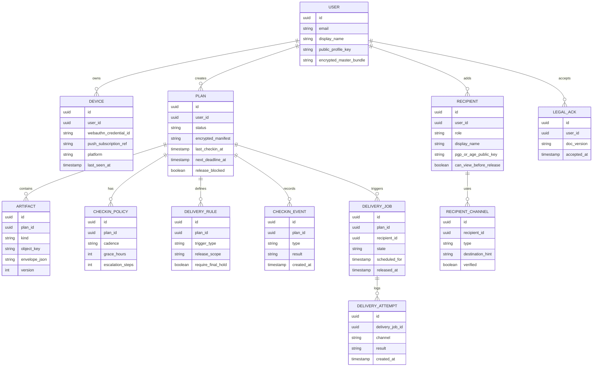
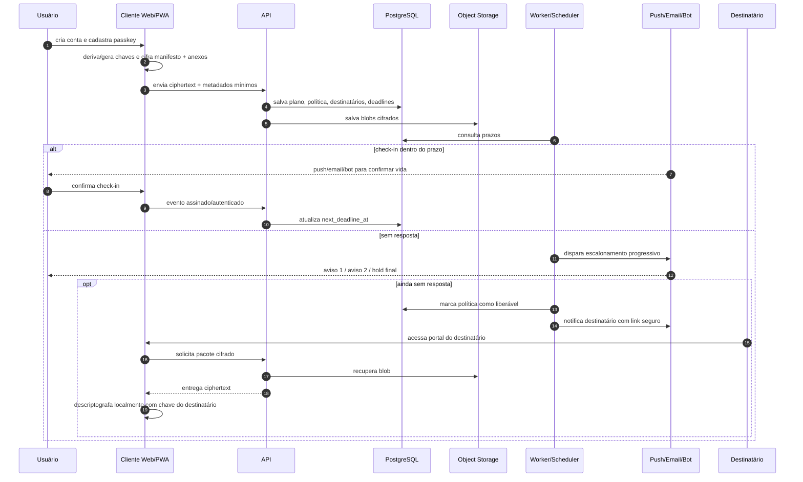

# Guia prático para construir um SaaS open source de continuidade digital com criptografia client-side

## Resumo executivo

A melhor forma de construir um **Dead-Man-Switch / Legacy Vault** sério não é “mandar senhas por e-mail se eu sumir”. Isso é o caminho mais curto para vazamento, abuso e falso positivo. O desenho correto é: **o app só guarda ciphertext**, a decisão de liberação passa por uma **escada de confirmação** configurável, e os canais como e-mail, Telegram e WhatsApp servem principalmente para **notificar e conduzir o fluxo**, enquanto o acesso ao conteúdo sensível acontece por **download autenticado de um pacote criptografado** ou por **descriptografia local com chave do destinatário**. Essa arquitetura é coerente com zero-knowledge, com a Web Crypto API, com o modelo de criptografia ponta a ponta adotado por cofres como o Bitwarden, e com o fato de que canais de mensageria e bots têm limites importantes de privacidade e automação. citeturn3search4turn3search12turn20search3turn20search6turn25search11turn5search3turn22search3turn38search4

Para um fundador solo, o MVP com melhor relação entre velocidade, segurança e capacidade de aprender fazendo é: **frontend web/PWA em TypeScript**, **criptografia no cliente com Web Crypto + libsodium.js**, **PostgreSQL para metadados**, **MinIO para blobs criptografados**, **WebAuthn/passkeys + TOTP para autenticação**, **Web Push e e-mail como canais nativos de check-in**, e **Telegram/WhatsApp apenas para lembretes, nunca para despejar segredos em texto puro**. Se quiser mobile depois, um wrapper com Expo simplifica push para Android/iOS; se quiser self-hosting real, Coolify ou Dokku em VPS resolvem muito bem a camada operacional inicial. citeturn18search0turn18search1turn20search1turn20search5turn7search0turn40search4turn9search0turn8search2turn8search0turn6search9turn26search0turn16search0turn16search1

O produto deve ser tratado como **continuidade digital e execução de instruções privadas**, não como “testamento digital” em sentido jurídico. No Brasil, LGPD, Marco Civil e regras da ANPD exigem transparência, medidas de segurança, gestão de incidentes e definição clara dos agentes de tratamento; além disso, há projetos legislativos recentes sobre bens digitais e testamento digital, o que mostra que a área ainda está em consolidação normativa. A posição prudente é explicitar em Termos e Política de Privacidade que a plataforma **não substitui testamento, inventário, ordem judicial, políticas de plataformas nem sucessão formal**. citeturn11search0turn11search1turn12search0turn30search0turn12search5turn35search0turn35search4turn35search9

Minha recomendação estratégica é dura e simples: **não comece tentando ser “o cofre definitivo de senhas pós-morte”**. Comece sendo o **orquestrador open source de continuidade digital**: check-ins configuráveis, cofres cifrados, destinatários com regras, provas de vida leves, entregas graduais e integração com recursos nativos já existentes em big techs, como **Google Inactive Account Manager, Apple Legacy Contact e Facebook Legacy Contact**. Isso reduz risco jurídico, aumenta confiança e te coloca numa posição clara de complementar — e não prometer superar — o que Google, Apple e Meta já controlam nas próprias contas. citeturn17search0turn17search1turn17search2turn17search10turn17search20

## Proposta de produto e princípios de escopo

O produto ideal tem cinco pilares: **planejamento**, **check-in**, **cripto**, **escalonamento** e **entrega**. Planejamento significa cadastrar instruções, contatos, anexos e regras. Check-in significa permitir cadência semanal, mensal ou anual, mais janelas de tolerância e revalidação. Cripto significa que o servidor nunca vê o segredo em claro. Escalonamento significa aumentar a intensidade do contato antes de qualquer liberação. Entrega significa notificar destinatários e oferecer um meio seguro de obter o pacote descriptografável. Essa abordagem é mais alinhada com as capacidades reais da Push API, do WebAuthn, da geolocalização e dos modelos de mensageria de Telegram e WhatsApp do que uma automação simplista baseada em “sumiu = morreu”. citeturn6search9turn6search10turn6search3turn5search3turn38search6

Os **recursos obrigatórios** do MVP, na prática, são: cadência configurável; múltiplos canais de check-in; política de tolerância; cofre com notas e anexos criptografados; destinatários com papéis distintos; trilha de auditoria de eventos; exportação de pacote de recuperação; e uma escada de escalonamento com cancelamento fácil pelo titular. O que eu **não** colocaria no MVP: verificação oficial de óbito, integração bancária, execução automática de ordens em serviços de terceiros, ou promessa de “acesso garantido” a contas alheias. Os próprios provedores mantêm políticas próprias para contas inativas ou de pessoas falecidas, e o seu SaaS deve respeitar esse limite. citeturn17search0turn17search1turn17search5turn17search10

Uma regra de produto importante: **biometria e localização são sinais auxiliares, não gatilhos de morte**. WebAuthn e passkeys permitem autenticação forte com criptografia de chave pública; na prática, a biometria fica no dispositivo e é mediada pelo autenticador/plataforma. Já a geolocalização no navegador depende de HTTPS, permissão explícita e pode ser bloqueada por política de permissões. Portanto, biometria serve bem para **step-up auth** e reautenticação; localização serve, no máximo, como indício de contexto. Usar qualquer um desses sinais como “prova de vida definitiva” é uma má ideia de produto e uma má ideia de segurança. citeturn7search0turn21search1turn21search15turn6search3turn6search7turn6search23

### Matriz prática dos canais de check-in

| Canal | Serve bem para | Limite estrutural | Recomendação |
|---|---|---|---|
| Push web/PWA | lembretes rápidos, reengajamento, check-in em 1 toque | depende de opt-in, navegador e contexto seguro; no iOS web há particularidades de suporte | **canal principal do MVP web** |
| E-mail | redundância universal, trilha documental | inbox comprometida e atraso de entrega | **canal secundário obrigatório** |
| Telegram bot | nudges, botões rápidos, fluxos simples | bots usam Bot API HTTP; não trate como canal de segredo | **bom para lembretes** |
| WhatsApp Cloud API | alto alcance, confirmação fora da janela ativa com templates | exige opt-in e templates fora da janela de atendimento; o conteúdo enviado pelo negócio passa pelo fluxo da Cloud API antes da cifra de transporte | **bom para lembretes premium, não para payload sensível** |
| Biometrics / passkeys | reautenticação local forte | não substitui esquema de recuperação de chaves | **use para step-up auth** |
| Localização | sinal fraco de contexto | depende de permissão, HTTPS e pode falhar por rede/dispositivo | **use só como telemetria opcional** |

A Push API entrega mensagens para apps web mesmo fora de primeiro plano, desde que o usuário tenha optado pelo recurso; WebAuthn/passkeys trazem autenticação forte com chave pública; Telegram expõe bots pela Bot API HTTP; WhatsApp exige opt-in e templates em vários cenários de mensagem fora da janela de atendimento; e a API de geolocalização exige contexto seguro e consentimento. Essas características tornam a combinação **push + e-mail + step-up auth** o coração mais sólido do MVP. citeturn6search1turn6search9turn6search12turn7search0turn40search4turn5search3turn22search2turn5search2turn5search6turn5search17turn38search12turn6search3turn6search7

## Modelo de ameaça e requisitos de segurança

O **modelo de ameaça** mínimo deve assumir: operador curioso, servidor comprometido, banco de dados vazado, bucket de objetos exposto, dispositivo do usuário roubado, caixa postal do destinatário comprometida, bot de mensageria interceptado no backend, erro de escalonamento, perda de chaves e ataque à cadeia de suprimentos do front-end. Se você não modelar esses cenários desde o início, vai acabar construindo um SaaS “bonito” por fora e estruturalmente fraco por dentro. OWASP ASVS, WSTG e os cheat sheets de armazenamento criptográfico, senhas, segredos e gestão de chaves são a base certa para esse desenho. citeturn10search0turn10search20turn10search1turn10search5turn10search9turn10search21

Os **requisitos não negociáveis** são estes. Primeiro: **zero-knowledge de verdade**, ou seja, cifrar antes de enviar e manter o servidor incapaz de ler o conteúdo. Segundo: **chaves por envelope**, com DEK por plano/arquivo e KEK derivada do segredo do usuário ou protegida por chaves públicas dos destinatários. Terceiro: **autenticidade**, com AEAD e metadados autenticados. Quarto: **recuperação planejada**, porque cofre impossível de recuperar é fracasso de produto. Quinto: **segregação entre metadados e segredos**, porque uma plataforma de continuidade inevitavelmente precisa armazenar cronogramas, canais e eventos, mas não precisa ler o conteúdo do cofre. Isso é coerente tanto com as recomendações da OWASP quanto com as arquiteturas zero-knowledge documentadas pelo Bitwarden. citeturn10search1turn10search9turn3search4turn3search12turn25search11

### Escolhas criptográficas recomendadas

| Problema | Escolha recomendada | Motivo | Observação |
|---|---|---|---|
| Autenticação | WebAuthn/passkeys + TOTP de fallback | chave pública, MFA forte, sem SMS | TOTP segue RFC 6238 |
| Derivação de chave a partir de senha | **Argon2id via libsodium** | memória-dura e própria para senhas | PBKDF2 fica como fallback de compatibilidade |
| Criptografia de blobs pequenos | AES-GCM via Web Crypto | nativo no navegador, bom desempenho | requer IV único e AAD bem definido |
| Criptografia de arquivos grandes/streaming | `crypto_secretstream_*` do libsodium | rotação de chave, integridade por chunk, sem limite prático de tamanho | excelente para anexos |
| Compartilhamento com destinatários | OpenPGP.js ou age | múltiplos destinatários e chaves explícitas | PGP é mais interoperável; age é mais simples |
| Recuperação | pacote offline + chaves públicas de destinatários + período de espera | reduz dependência do servidor | copie o conceito de “emergency access” com atraso controlado |

A documentação do libsodium recomenda Argon2id para `crypto_pwhash_*`; a Web Crypto API expõe PBKDF2 e HKDF, deixando claro que PBKDF2 é a opção para entradas de baixa entropia como senha; AES-GCM é suportado nativamente pela Web Crypto; e `crypto_secretstream_*` foi desenhada justamente para streams e arquivos grandes. Para compartilhamento entre múltiplos destinatários, OpenPGP.js suporta criptografia com chaves públicas, senhas ou ambos; age foi desenhado como formato simples e moderno, e já possui implementação TypeScript oficial/adjacente para o ecossistema de browser. citeturn18search0turn18search1turn20search1turn20search5turn19search1turn23search1turn23search3turn24search0turn24search2

A decisão entre **OpenPGP** e **age** é pragmática. Se você quer **interoperabilidade com destinatários técnicos**, ferramentas existentes e chaves que usuários mais avançados já conhecem, OpenPGP.js faz mais sentido. Se você quer **exportação simples de pacotes**, chaves curtas e um formato menor para um fluxo “baixe o pacote e abra com sua identidade”, age é excelente. Minha leitura prática é: **PGP para destinatário técnico; age para export/import de emergência; Web Crypto/libsodium para a cifra interna do produto**. citeturn23search1turn23search3turn24search2turn24search0

Há um ponto espinhoso e importante: **cripto em JavaScript entregue pela web tem um problema de confiança de hospedagem**. A própria documentação do OpenPGP.js alerta que apps de cripto servidos pela web oferecem menos garantias do que apps instaláveis com versões auditáveis. Isso significa que, se você vai reivindicar segurança séria, precisa adotar CSP rígida, SRI, dependências fixadas, builds reproduzíveis, imagens assinadas, release assets verificáveis e, idealmente, um cliente instalável ou wrapper mobile nas fases seguintes. Quem ignora isso e sai vendendo “cofre zero-knowledge” está pedindo para ser cobrado depois. citeturn39search0turn10search1turn37search1turn37search14

## Arquitetura, dados e fluxos

A arquitetura correta separa o sistema em três camadas: **cliente confiável para criptografia**, **API/worker para orquestração**, e **armazenamento burro de ciphertext**. O cliente gera ou deriva chaves, cifra plano/notas/anexos localmente e envia somente envelope + ciphertext + metadados mínimos. O backend agenda check-ins, registra eventos, valida autenticação, dispara notificações e libera pacotes apenas quando a política manda. PostgreSQL entra como trilha de metadados e eventos; o bucket de objetos guarda apenas blobs criptografados; e a criptografia em repouso do storage é defesa adicional, não o limite primário de confiança. citeturn20search3turn20search6turn8search2turn8search0turn8search20turn3search4



Esse modelo favorece um princípio crucial: **segredo cifrado separado de política operacional**. Mesmo que a base relacional vaze, o atacante deveria obter cronogramas, canais, IDs e eventos — não o conteúdo do cofre. PostgreSQL oferece Row-Level Security para isolar linhas por usuário, e MinIO adiciona criptografia em repouso e suporte a gestão de chaves no storage; mas o segredo real continua sendo a cifra client-side. citeturn8search2turn8search6turn8search0turn8search8



O fluxo acima também deixa claro por que **“anexo TXT por e-mail” deve ser exceção, não padrão**. A forma segura de entrega é: e-mail/WhatsApp/Telegram notificam que existe um pacote disponível; o destinatário abre um portal ou baixa um arquivo cifrado e o cliente faz a descriptografia local. Se você absolutamente quiser anexar algo, que seja um arquivo **criptografado por chave pública do destinatário** em OpenPGP/age — jamais um `.txt` em claro. citeturn23search3turn24search2turn38search4turn22search3turn25search11

## Stack OSS recomendada e comparativos

### Alternativas de backend e storage

| Opção | Pontos fortes | Pontos fracos | Minha leitura para este produto |
|---|---|---|---|
| **Postgres + MinIO + API própria** | máximo controle, arquitetura simples, storage robusto, RLS e blobs separados | exige mais código próprio | **melhor base para um produto de segurança** |
| **Supabase self-hosted** | sobe com Docker, UX boa, Realtime e Auth prontos | versão self-hosted pode não ter o “latest” imediatamente | **ótimo para MVP se você aceitar a camada Supabase** |
| **Appwrite self-hosted** | instalação Docker guiada, auth/storage/functions prontas, docs de produção e segurança | acoplamento maior ao ecossistema Appwrite | **forte candidato se você prefere menos código de backend** |
| **Nhost self-hosted/community** | stack local completa com Postgres, Hasura, Auth, Storage, Functions e Mailhog | mais peças para operar | **bom para time pequeno mais backend-oriented** |
| **PocketBase** | simples, binário único, auth e realtime rápidos | SQLite embutido; sem outros bancos “out of the box”; docs alertam que algumas configs ficam em JSON plain text por padrão | **eu evitaria para o cofre principal sensível** |

Supabase documenta self-hosting via Docker e informa que a experiência self-hosted é muito próxima da hospedada, mas pode não refletir o “latest” imediatamente; Appwrite fornece instalação e guias de produção/segurança; Nhost mostra um ambiente local com PostgreSQL, Hasura, Auth, Storage, Functions e Mailhog; PocketBase é incrível para protótipos, mas se apoia em SQLite e sua própria documentação destaca cuidados de produção, inclusive armazenamento de certas configurações em JSON plano por padrão. citeturn3search6turn3search16turn3search7turn3search17turn4search17turn4search0turn4search8turn4search12

Se a prioridade é **aprender construindo** e manter o produto totalmente open source, eu escolheria este stack-base para o MVP:

| Camada | Recomendação |
|---|---|
| Frontend | Next.js/React + TypeScript + PWA |
| Criptografia | Web Crypto API + libsodium.js |
| Auth | WebAuthn/passkeys + TOTP fallback |
| API | Node/TypeScript |
| Metadados | PostgreSQL |
| Objetos | MinIO |
| Worker | processo dedicado simples com polling/cron + fila leve |
| Push web | Push API / Web Push |
| E-mail MVP | Resend |
| E-mail self-host | Postal |
| Teste de e-mail | Mailpit |
| Mensageria | Telegram Bot API; WhatsApp Cloud API para lembretes; Matrix opcional para entrega mais segura |
| Deploy | Coolify ou Dokku em VPS; evolução para orquestração maior se necessário |

As escolhas acima são compatíveis com a disponibilidade de Push API na web, WebAuthn/passkeys, FCM/APNs via Expo se você empacotar mobile, MinIO com SSE e TLS, e ferramentas de e-mail voltadas a MVP ou self-host. citeturn6search9turn7search0turn40search4turn26search0turn26search1turn8search0turn8search20turn9search2turn36search0turn36search8turn36search5turn5search3turn38search6turn13search3turn16search0turn16search1

### Projetos open source e APIs que valem reaproveitamento

| Projeto / API | O que reaproveitar |
|---|---|
| **Bitwarden** | padrão de zero-knowledge, emergency access, biometria/passkeys, self-host |
| **KeePassXC** | modelo mental de cofre local e import/export para usuários paranoicos com nuvem |
| **OpenPGP.js** | cifragem para múltiplos destinatários, assinaturas e interoperabilidade |
| **age / typage** | exportação enxuta de pacote cifrado e identidade explícita |
| **Matrix** | opção open protocol com E2EE para fluxos mais sensíveis e bots/integrations |
| **Telegram Bot API** | lembretes e UX rápida por bot |
| **WhatsApp Cloud API** | lembretes premium e altíssimo alcance, com opt-in |
| **signal-cli** | somente experimental; é útil, mas não é oficial |

Bitwarden documenta zero-knowledge, emergency access baseado em criptografia assimétrica, biometria e self-hosting; KeePassXC documenta banco local cifrado, anexos e TOTP; OpenPGP.js suporta cifra com chaves e senhas e usa Web Crypto quando disponível; age se posiciona como ferramenta/formato simples e moderno; Matrix documenta bots, application services e E2EE; Telegram expõe bots pela Bot API; WhatsApp documenta Cloud API, opt-in e templates; e `signal-cli` se apresenta explicitamente como cliente não oficial. citeturn3search4turn25search11turn25search12turn25search20turn25search6turn25search9turn23search1turn23search3turn24search0turn24search2turn13search3turn13search13turn13search2turn5search3turn22search2turn38search6turn38search12turn13search1

Minha opinião aqui é bem clara: **Telegram e WhatsApp entram como canais de notificação, não como canal canônico de entrega do segredo**. Em Telegram, a própria documentação separa bots da lógica de Secret Chats, que são E2EE e device-specific entre participantes humanos; em WhatsApp, a Cloud API protege o transporte com Signal, mas a própria documentação deixa claro que a criptografia ocorre no fluxo da plataforma ao receber a mensagem do negócio, ou seja, o conteúdo já passou pelo ambiente do remetente/integração. Para um SaaS zero-knowledge, isso basta para eu cravar: **não entregue o cofre por bot**. citeturn22search2turn22search3turn22search7turn38search2turn38search4

## Implementação mínima com exemplos de código

O menor plano que faz sentido para sair do zero ao MVP é este: **conta + passkey + TOTP; criar plano; anexar nota cifrada; anexar arquivo cifrado; configurar cadência e grace period; registrar 2 canais de check-in; criar 1 destinatário com chave pública; simular expiração; disparar notificação; entregar pacote cifrado; permitir cancelamento durante o hold final**. Dá para provar o produto inteiro com isso sem cair na armadilha de operar um castelo antes de ter uma cabana funcional. A cifra no cliente pode começar com Web Crypto; em produção, vale migrar a derivação de chave principal para Argon2id com libsodium.js. citeturn20search3turn20search6turn18search0turn18search1

### Exemplo de criptografia client-side no navegador

O exemplo abaixo mostra um envelope mínimo com **PBKDF2 + AES-GCM** usando a Web Crypto API. Ele é bom para aprender, prototipar e testar o fluxo. Para produção, troque a derivação principal para **Argon2id via libsodium.js** e use versionamento de envelope com AAD estável. citeturn20search1turn20search5turn18search0

```ts
type EncryptedEnvelopeV1 = {
  v: 1;
  alg: "AES-GCM";
  kdf: "PBKDF2-SHA-256";
  iterations: number;
  saltB64: string;
  ivB64: string;
  aadB64: string;
  cipherB64: string;
};

const te = new TextEncoder();
const td = new TextDecoder();

function toB64(bytes: Uint8Array): string {
  return btoa(String.fromCharCode(...bytes));
}

function fromB64(b64: string): Uint8Array {
  return Uint8Array.from(atob(b64), c => c.charCodeAt(0));
}

async function deriveAesKey(passphrase: string, salt: Uint8Array, iterations = 310000) {
  const baseKey = await crypto.subtle.importKey(
    "raw",
    te.encode(passphrase),
    "PBKDF2",
    false,
    ["deriveKey"]
  );

  return crypto.subtle.deriveKey(
    {
      name: "PBKDF2",
      hash: "SHA-256",
      salt,
      iterations,
    },
    baseKey,
    { name: "AES-GCM", length: 256 },
    false,
    ["encrypt", "decrypt"]
  );
}

export async function encryptText(
  plaintext: string,
  passphrase: string,
  aad: Record<string, unknown> = {}
): Promise<EncryptedEnvelopeV1> {
  if (!passphrase || passphrase.length < 12) {
    throw new Error("Use uma passphrase mais forte para o protótipo.");
  }

  const salt = crypto.getRandomValues(new Uint8Array(16));
  const iv = crypto.getRandomValues(new Uint8Array(12));
  const aadBytes = te.encode(JSON.stringify(aad));
  const key = await deriveAesKey(passphrase, salt);

  const ciphertext = await crypto.subtle.encrypt(
    { name: "AES-GCM", iv, additionalData: aadBytes },
    key,
    te.encode(plaintext)
  );

  return {
    v: 1,
    alg: "AES-GCM",
    kdf: "PBKDF2-SHA-256",
    iterations: 310000,
    saltB64: toB64(salt),
    ivB64: toB64(iv),
    aadB64: toB64(aadBytes),
    cipherB64: toB64(new Uint8Array(ciphertext)),
  };
}

export async function decryptText(
  envelope: EncryptedEnvelopeV1,
  passphrase: string
): Promise<string> {
  if (envelope.v !== 1) throw new Error("Versão de envelope não suportada.");

  const salt = fromB64(envelope.saltB64);
  const iv = fromB64(envelope.ivB64);
  const aadBytes = fromB64(envelope.aadB64);
  const cipherBytes = fromB64(envelope.cipherB64);

  const key = await deriveAesKey(passphrase, salt, envelope.iterations);

  const plainBuffer = await crypto.subtle.decrypt(
    { name: "AES-GCM", iv, additionalData: aadBytes },
    key,
    cipherBytes
  );

  return td.decode(plainBuffer);
}
```

### Exemplo mínimo de envio de e-mail no backend

Para o MVP, um provedor como o Resend reduz fricção operacional. Quando o produto ganhar volume e necessidade de soberania operacional, você pode migrar a camada de entrega para Postal. Mailpit é ótimo para desenvolvimento local e testes de integração de e-mail. citeturn9search2turn9search13turn36search0turn36search8turn36search5

```ts
// app/api/send-checkin-email/route.ts
import { NextRequest, NextResponse } from "next/server";

export async function POST(req: NextRequest) {
  const { to, subject, html } = await req.json();

  if (!Array.isArray(to) || to.length === 0) {
    return NextResponse.json({ error: "Lista de destinatários inválida." }, { status: 400 });
  }

  const apiKey = process.env.RESEND_API_KEY;
  const from = process.env.MAIL_FROM;

  if (!apiKey || !from) {
    return NextResponse.json({ error: "Variáveis de ambiente ausentes." }, { status: 500 });
  }

  const response = await fetch("https://api.resend.com/emails", {
    method: "POST",
    headers: {
      "Authorization": `Bearer ${apiKey}`,
      "Content-Type": "application/json",
    },
    body: JSON.stringify({
      from,
      to,
      subject,
      html,
    }),
  });

  const data = await response.json();

  if (!response.ok) {
    return NextResponse.json({ error: "Falha ao enviar e-mail.", details: data }, { status: 502 });
  }

  return NextResponse.json({ ok: true, data });
}
```

### Exemplo mínimo de Telegram bot para lembretes

Telegram facilita muito a UX de lembrete porque o bot é simples de operar via HTTP. O que ele **não** deve fazer é virar canal de despejo do segredo. Use o bot para “Você precisa confirmar seu check-in” e “Existe um pacote disponível”, sempre preferindo links expirados para o cliente seguro. citeturn5search3turn22search2turn22search3

```ts
type TelegramSendMessageInput = {
  chatId: string;
  text: string;
  disablePreview?: boolean;
};

export async function sendTelegramMessage(input: TelegramSendMessageInput) {
  const token = process.env.TELEGRAM_BOT_TOKEN;
  if (!token) throw new Error("TELEGRAM_BOT_TOKEN ausente.");

  const resp = await fetch(`https://api.telegram.org/bot${token}/sendMessage`, {
    method: "POST",
    headers: { "Content-Type": "application/json" },
    body: JSON.stringify({
      chat_id: input.chatId,
      text: input.text,
      disable_web_page_preview: input.disablePreview ?? true,
    }),
  });

  const data = await resp.json();
  if (!resp.ok || !data.ok) {
    throw new Error(`Falha Telegram: ${JSON.stringify(data)}`);
  }

  return data.result;
}
```

### Exemplo mínimo de configuração local

```yaml
# docker-compose.yml
services:
  postgres:
    image: postgres:16
    environment:
      POSTGRES_DB: continuity
      POSTGRES_USER: continuity
      POSTGRES_PASSWORD: continuity-dev
    ports:
      - "5432:5432"
    volumes:
      - pgdata:/var/lib/postgresql/data

  minio:
    image: minio/minio:latest
    command: server /data --console-address ":9001"
    environment:
      MINIO_ROOT_USER: minio
      MINIO_ROOT_PASSWORD: minio-dev-password
    ports:
      - "9000:9000"
      - "9001:9001"
    volumes:
      - minio-data:/data

  mailpit:
    image: axllent/mailpit:latest
    ports:
      - "1025:1025"
      - "8025:8025"

volumes:
  pgdata:
  minio-data:
```

Esse `compose` é suficiente para começar com armazenamento estruturado, blobs cifrados e teste local de e-mail, sem te jogar imediatamente no inferno operacional de manter SMTP de produção. citeturn8search2turn8search0turn36search5

## Operação, deploy, testes e auditoria

Para **deploy**, existem três caminhos razoáveis. O mais pragmático para fundador solo é **VPS + Coolify**. O mais cru, simples e excelente para quem gosta de git push é **Dokku**. O caminho “multi-região/stateless” pode usar algo como **Fly.io** para a app layer, mas atenção: os volumes do Fly são armazenamento persistente local da máquina, então eu evitaria depender deles como base principal do cofre sem uma estratégia mais robusta de dados. Para infraestrutura econômica e previsível, Hetzner continua sendo uma escolha forte. citeturn16search0turn16search4turn16search1turn16search5turn16search2turn16search6turn16search3turn16search19

Para CI/CD, você pode ir de **GitHub Actions**, **Gitea Actions**, **Woodpecker** ou **GitLab CI/CD**. GitHub Actions é o caminho de menor fricção; Gitea Actions é ótima pedida se você quer máxima coerência open source e compatibilidade mental com o ecossistema Actions; Woodpecker é um motor enxuto e elegante; GitLab é mais encorpado. Em qualquer caso, a pipeline precisa compilar, testar, gerar imagem, escanear a imagem, gerar SBOM e assinar os artefatos. citeturn10search3turn10search15turn27search0turn27search3turn27search1turn27search7turn27search2turn27search5

A cadeia mínima de hardening da pipeline deveria ser: **Trivy** para vulnerabilidades, **Syft** para SBOM em SPDX/CycloneDX, e **Cosign/Sigstore** para assinatura e verificação de imagens/artefatos. Isso é o tipo de disciplina que separa um “side project simpático” de um produto que pode encarar auditoria sem passar vergonha. citeturn10search2turn10search22turn37search0turn37search16turn37search1turn37search14

Em testes, eu dividiria em quatro trilhas. **Cripto**: vetores conhecidos, round-trip, rotação de versão de envelope, alteração de AAD/IV/ciphertext e verificação de falha. **Produto**: check-in, grace period, escalonamento, cancelamento no hold final, suspensão por viagem/doença sem falso disparo. **Canais**: push recusado, e-mail em atraso, bot bloqueado, mudança de número, Falha API externa. **Operação**: restore de backup, perda de worker, relógio desalinhado, incidente de storage, recuperação de chave e reemissão de pacote. ASVS e WSTG ajudam a transformar isso em critérios objetivos, não “sensação” de segurança. citeturn10search0turn10search20turn10search1turn10search9

### Checklist priorizado

- [ ] Implementar cifra client-side antes de qualquer upload de conteúdo sensível. citeturn20search3turn3search4
- [ ] Adotar WebAuthn/passkeys e TOTP fallback desde o primeiro release privado. citeturn7search0turn40search4turn9search0
- [ ] Separar metadados operacionais de blobs cifrados em storage distinto. citeturn8search2turn8search0
- [ ] Usar Telegram/WhatsApp só para lembretes e links expirados. citeturn22search3turn38search4
- [ ] Implementar hold final obrigatório antes de liberar qualquer pacote. citeturn25search11
- [ ] Oferecer exportação offline do plano em OpenPGP ou age. citeturn23search3turn24search2
- [ ] Testar restauração de backups e recuperação de chave todo mês. citeturn10search9turn12search1
- [ ] Gerar SBOM, escanear imagens e assinar releases. citeturn37search0turn10search22turn37search14
- [ ] Publicar threat model e limitações antes de falar “zero-knowledge”. citeturn10search0turn39search0
- [ ] Fazer auditoria externa antes do lançamento público pago. citeturn3search15turn39search0

## Jurídico no Brasil, monetização e roadmap

No Brasil, a régua mínima é clara. A **LGPD** rege tratamento de dados pessoais inclusive em meios digitais; a autoridade reguladora publicou materiais e regulamentos específicos para agentes de pequeno porte, segurança da informação, atuação do encarregado e comunicação de incidentes; e o **Marco Civil da Internet** segue relevante para governança, aplicação de internet e segurança. Além disso, a ANPD informa hoje que incidentes passíveis de comunicação devem, em regra, ser reportados em até **três dias úteis** à ANPD e aos titulares, nos termos da Resolução CD/ANPD nº 15/2024. citeturn11search0turn11search1turn11search6turn11search16turn12search3turn12search5turn30search0turn30search2

Em termos práticos, seus **Termos de Uso** deveriam conter, no mínimo, estas mensagens centrais: o serviço é uma ferramenta de continuidade digital e execução de instruções privadas; não substitui testamento, inventário, alvará, ordem judicial nem políticas de plataformas; a configuração de destinatários e conteúdo é de responsabilidade do usuário; a plataforma aplica política de escalonamento e período de retenção antes da liberação; e a empresa pode suspender uma liberação em caso de indício de fraude, disputa, invasão de conta ou determinação legal. Isso não elimina risco, mas delimita expectativa — e delimitar expectativa aqui é parte do produto. citeturn11search0turn30search0turn12search5turn35search0turn35search4

Sua **Política de Privacidade** deve ser honestamente específica. Eu incluiria seções sobre: categorias de dados tratadas; finalidade de cada dado; base legal mapeada por finalidade; retenção; operadores/fornecedores; transferências internacionais; direitos do titular; canal do encarregado; resposta a incidentes; logs e auditoria; e, principalmente, uma seção de **arquitetura de confidencialidade** explicando o que é e o que não é zero-knowledge. Transparência mal feita destrói confiança; transparência bem feita vira diferencial competitivo. citeturn28search2turn28search12turn11search27turn12search5

Também é importante verbalizar a fronteira jurídica do produto com contas de terceiros. Google oferece **Inactive Account Manager**; Apple oferece **Legacy Contact** e fluxo para conta de pessoa falecida; Facebook oferece **Legacy Contact** e memorialização. O seu SaaS deve encorajar o usuário a também configurar essas opções nativas, porque elas tratam justamente do que só o provedor consegue resolver legitimamente dentro do próprio ecossistema. citeturn17search0turn17search1turn17search5turn17search2turn17search10

Há ainda uma nuance importante: entre 2025 e 2026, a Câmara e o Senado divulgaram projetos e reportagens oficiais sobre **bens digitais**, **inventariante digital** e **testamento digital simplificado**, o que indica que a disciplina legislativa está em movimento. Isso reforça a estratégia mais prudente para seu branding e seus textos legais: **“cofre de continuidade digital”**, **“vault de instruções privadas”**, **“execução de contingência pessoal”**. Evite vender “testamento digital” como fato consolidado. citeturn35search0turn35search4turn35search9turn35search1

### Modelo de monetização e apoio ao fundador

A monetização mais saudável para esse tipo de produto é híbrida: **free tier útil + recursos premium claros + doações abertas**. GitHub Sponsors permite receber apoio diretamente e até exibir botão de sponsor no repositório; Open Collective é muito bom se você quiser transparência financeira pública desde cedo; e, no Brasil, adicionar uma opção simples de **Pix/café** faz todo sentido para apoio informal do fundador. GitHub informa que patrocínios de contas pessoais não sofrem taxa do GitHub; Open Collective documenta explicitamente a proposta de transparência financeira; e o Banco Central documenta o Pix como arranjo instantâneo com chaves como e-mail, telefone e EVP. citeturn14search0turn14search7turn14search11turn14search13turn14search1turn14search4turn14search16turn15search3turn15search2

### Estrutura de planos sugerida

| Faixa | O que inclui |
|---|---|
| **Grátis** | 1 plano ativo, 3 destinatários, check-in semanal/mensal/anual, push + e-mail, 1 export offline, branding open source |
| **Pago pessoal** | canais premium, mais destinatários, mais storage cifrado, WhatsApp lembrete, múltiplos planos, versão mobile, pacote legal/guia de continuidade |
| **Pago família** | 5 a 10 membros, administrador familiar, templates por membro, central de contingência |
| **Doações / café** | apoio avulso, badge de apoiador, roadmap público, voto consultivo em features não sensíveis |

Se você quiser ser radicalmente alinhado ao DNA open source, faça o seguinte: **código AGPL para servidor**, **SDKs/utilitários com licença mais permissiva**, **roadmap público**, **changelog público**, e um botão “me pague um café” visível no site e no repositório. Isso faz sentido para a economia moral do projeto e para o tipo de usuário que valoriza transparência. citeturn14search3turn14search11turn14search14

### Roadmap com esforço estimado

| Marco | Entrega | Estimativa solo full-time |
|---|---|---|
| **Fundação** | auth, passkeys, TOTP, esquema de envelope, notas cifradas, Postgres + MinIO local | 2 a 3 semanas |
| **MVP privado** | check-ins, grace period, push/e-mail, destinatários, hold final, export OpenPGP/age | 3 a 5 semanas |
| **Beta fechado** | anexos grandes com streaming, Telegram bot, observabilidade, restore drill, docs legais básicas | 2 a 4 semanas |
| **Beta pago** | WhatsApp premium, billing, sponsor page, onboarding refinado, auditoria interna séria | 3 a 4 semanas |
| **Lançamento público** | auditoria externa, política de incidentes, SLA honesto, mobile wrapper opcional | 4 a 8 semanas |

A estimativa total razoável para um fundador solo fazer isso **direito** — e não “nas coxas” — é algo como **10 a 16 semanas** até um beta pago confiável, assumindo foco total e escopo contido. Se você tentar colocar banco, verificação de óbito, integrações forçadas com plataformas e automações irreversíveis logo no começo, o projeto tende a ficar mais perigoso do que útil.

### Questões em aberto e limitações

Ainda existem decisões que dependem da sua tese de produto e do apetite de risco: se você vai priorizar **PWA primeiro** ou **mobile wrapper cedo**; se o pacote para destinatário será **OpenPGP**, **age** ou ambos; se o backend usará **stack própria** ou **BaaS self-host**; e qual será a estratégia jurídica exata de base legal e redação contratual após revisão profissional no Brasil. Também há uma limitação estrutural inevitável: nenhum SaaS desse tipo substitui políticas internas de Google, Apple, Meta, bancos ou ordens judiciais, então o valor real do produto está em **organizar, preservar, escalar e entregar instruções e segredos cifrados**, não em prometer poderes que ele não tem. citeturn17search0turn17search1turn17search2turn35search0turn35search4